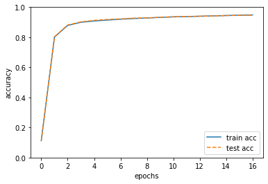
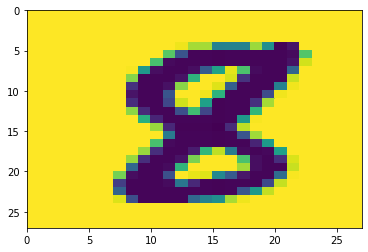

# 第3回レポート

## 1910094 植木 駿介


```python
import sys, os
sys.path.append(os.pardir)  
from common.functions import *
from common.gradient import numerical_gradient

class TwoLayerNet:

    def __init__(self, input_size, hidden_size, output_size, weight_init_std=0.01):
        #初期値を重みはランダム、バイアスはゼロに設定
        self.params = {}
        self.params['W1'] = weight_init_std * np.random.randn(input_size, hidden_size)
        self.params['b1'] = np.zeros(hidden_size)
        self.params['W2'] = weight_init_std * np.random.randn(hidden_size, output_size)
        self.params['b2'] = np.zeros(output_size)

    def predict(self, x):
        W1, W2 = self.params['W1'], self.params['W2']
        b1, b2 = self.params['b1'], self.params['b2']
        #1,2層の計算
        a1 = np.dot(x, W1) + b1
        z1 = sigmoid(a1)
        a2 = np.dot(z1, W2) + b2
        #確率で表す
        y = softmax(a2)
       
        return y
       
    # x:入力データ, t:教師データ
    def loss(self, x, t):
        y = self.predict(x)
        #誤差を交差エントロピー誤差関数を用いて求める
        return cross_entropy_error(y, t)
    
    def accuracy(self, x, t):
        y = self.predict(x)
        y = np.argmax(y, axis=1)
        t = np.argmax(t, axis=1)
        
        accuracy = np.sum(y == t) / float(x.shape[0])
        return accuracy
        
    # x:入力データ, t:教師データ
    def numerical_gradient(self, x, t):
        loss_W = lambda W: self.loss(x, t)
        
        grads = {}
        grads['W1'] = numerical_gradient(loss_W, self.params['W1'])
        grads['b1'] = numerical_gradient(loss_W, self.params['b1'])
        grads['W2'] = numerical_gradient(loss_W, self.params['W2'])
        grads['b2'] = numerical_gradient(loss_W, self.params['b2'])
        
        return grads
        
    def gradient(self, x, t):
        W1, W2 = self.params['W1'], self.params['W2']
        b1, b2 = self.params['b1'], self.params['b2']
        grads = {}
        
        batch_num = x.shape[0]
        
        # forward
        a1 = np.dot(x, W1) + b1
        z1 = sigmoid(a1)
        a2 = np.dot(z1, W2) + b2
        y = softmax(a2)
        
        # backward
        dy = (y - t) / batch_num
        grads['W2'] = np.dot(z1.T, dy)
        grads['b2'] = np.sum(dy, axis=0)
        
        da1 = np.dot(dy, W2.T)
        dz1 = sigmoid_grad(a1) * da1
        grads['W1'] = np.dot(x.T, dz1)
        grads['b1'] = np.sum(dz1, axis=0)

        return grads

import numpy as np
import matplotlib.pyplot as plt
from dataset.mnist import load_mnist

# データの読み込み
(x_train, t_train), (x_test, t_test) = load_mnist(normalize=True, one_hot_label=True) 

network = TwoLayerNet(input_size=784, hidden_size=50, output_size=10) 
# 繰り返しの回数を適宜設定する
iters_num = 10000  
train_size = x_train.shape[0]
batch_size = 100
learning_rate = 0.1

train_loss_list = []
train_acc_list = []
test_acc_list = []

iter_per_epoch = max(train_size / batch_size, 1) 

for i in range(iters_num):
    batch_mask = np.random.choice(train_size, batch_size)
    x_batch = x_train[batch_mask]
    t_batch = t_train[batch_mask]
    
    # 勾配の計算
    grad = network.gradient(x_batch, t_batch)
    
    # パラメータの更新
    for key in ('W1', 'b1', 'W2', 'b2'):
        network.params[key] -= learning_rate * grad[key]
    
    loss = network.loss(x_batch, t_batch)
    train_loss_list.append(loss)
    
    if i % iter_per_epoch == 0:
        train_acc = network.accuracy(x_train, t_train)
        test_acc = network.accuracy(x_test, t_test)
        train_acc_list.append(train_acc)
        test_acc_list.append(test_acc)
        print("train acc, test acc | " + str(train_acc) + ", " + str(test_acc))

# グラフの描画
markers = {'train': 'o', 'test': 's'}
x = np.arange(len(train_acc_list))
plt.plot(x, train_acc_list, label='train acc')
plt.plot(x, test_acc_list, label='test acc', linestyle='--')
plt.xlabel("epochs")
plt.ylabel("accuracy")
plt.ylim(0, 1.0)
plt.legend(loc='lower right')
plt.show()

i = np.random.randint(x_test.shape[0])
print('Test  :{}'.format(network.predict(x_test[i])>0.5))
print('Answer:{}'.format(t_test[i]>0.5))
img = x_test[i].reshape(28, 28)
plt.pcolor(255-img)
plt.xlim(0, 27)
plt.ylim(27, 0)
print('Test image')
plt.show()
```

    train acc, test acc | 0.11236666666666667, 0.1135
    train acc, test acc | 0.80165, 0.8032
    train acc, test acc | 0.8785166666666666, 0.8816
    train acc, test acc | 0.89965, 0.9021
    train acc, test acc | 0.9081166666666667, 0.9124
    train acc, test acc | 0.91425, 0.9182
    train acc, test acc | 0.92, 0.9218
    train acc, test acc | 0.9244333333333333, 0.9271
    train acc, test acc | 0.9281666666666667, 0.9287
    train acc, test acc | 0.9318666666666666, 0.9327
    train acc, test acc | 0.93545, 0.9362
    train acc, test acc | 0.9372, 0.938
    train acc, test acc | 0.9397666666666666, 0.9399
    train acc, test acc | 0.9421166666666667, 0.9414
    train acc, test acc | 0.9443, 0.9443
    train acc, test acc | 0.94665, 0.9457
    train acc, test acc | 0.9483833333333334, 0.9462
    





    Test  :[False False False False False False False False  True False]
    Answer:[False False False False False False False False  True False]
    Test image
    





## 感想
学習中のグラフの様子から過学習が行われず正しく正答率が上がっていることが確認できた。しかし、学習は最終的には徐々にしか上がっておらず、学習回数を多くしすぎても最終的な正答率の変化は小さくなってしまうことがわかった。最後に学習結果を確かめるために簡単な確認を行った。正解ラベルの結果と学習後の出力の結果が一致し正しいことも確認できた。

## 参考
物体画像認識と時系列データ処理入門　著チーム・カルポ
