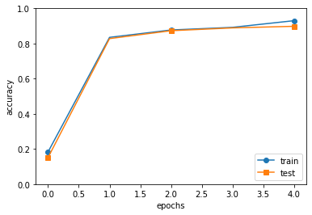

# レポート課題５
## 1910094 植木 駿介


```python
# coding: utf-8
import sys, os
sys.path.append(os.pardir)  
import pickle
import numpy as np
from collections import OrderedDict
from common.layers import *
from common.gradient import numerical_gradient


class SimpleConvNet:

    def __init__(self, input_dim=(1, 28, 28), 
                 conv_param={'filter_num':30, 'filter_size':5, 'pad':0, 'stride':1},
                 hidden_size=100, output_size=10, weight_init_std=0.01):
        filter_num = conv_param['filter_num']
        filter_size = conv_param['filter_size']
        filter_pad = conv_param['pad']
        filter_stride = conv_param['stride']
        input_size = input_dim[1]
        conv_output_size = (input_size - filter_size + 2*filter_pad) / filter_stride + 1
        pool_output_size = int(filter_num * (conv_output_size/2) * (conv_output_size/2))

        # 重みの初期化
        self.params = {}
        self.params['W1'] = weight_init_std * \
                            np.random.randn(filter_num, input_dim[0], filter_size, filter_size)
        self.params['b1'] = np.zeros(filter_num)
        self.params['W2'] = weight_init_std * \
                            np.random.randn(pool_output_size, hidden_size)
        self.params['b2'] = np.zeros(hidden_size)
        self.params['W3'] = weight_init_std * \
                            np.random.randn(hidden_size, output_size)
        self.params['b3'] = np.zeros(output_size)

        # レイヤの生成
        self.layers = OrderedDict()
        self.layers['Conv1'] = Convolution(self.params['W1'], self.params['b1'],
                                           conv_param['stride'], conv_param['pad'])
        self.layers['Relu1'] = Relu()
        self.layers['Pool1'] = Pooling(pool_h=2, pool_w=2, stride=2)
        self.layers['Affine1'] = Affine(self.params['W2'], self.params['b2'])
        self.layers['Relu2'] = Relu()
        self.layers['Affine2'] = Affine(self.params['W3'], self.params['b3'])

        self.last_layer = SoftmaxWithLoss()

    def predict(self, x):
        for layer in self.layers.values():
            x = layer.forward(x)

        return x

    def loss(self, x, t):
        y = self.predict(x)
        return self.last_layer.forward(y, t)

    def accuracy(self, x, t, batch_size=100):
        if t.ndim != 1 : t = np.argmax(t, axis=1)
        
        acc = 0.0
        
        for i in range(int(x.shape[0] / batch_size)):
            tx = x[i*batch_size:(i+1)*batch_size]
            tt = t[i*batch_size:(i+1)*batch_size]
            y = self.predict(tx)
            y = np.argmax(y, axis=1)
            acc += np.sum(y == tt) 
        
        return acc / x.shape[0]

    def numerical_gradient(self, x, t):
        loss_w = lambda w: self.loss(x, t)

        grads = {}
        for idx in (1, 2, 3):
            grads['W' + str(idx)] = numerical_gradient(loss_w, self.params['W' + str(idx)])
            grads['b' + str(idx)] = numerical_gradient(loss_w, self.params['b' + str(idx)])

        return grads

    def gradient(self, x, t):
        # forward
        self.loss(x, t)

        # backward
        dout = 1
        dout = self.last_layer.backward(dout)

        layers = list(self.layers.values())
        layers.reverse()
        for layer in layers:
            dout = layer.backward(dout)

        # 設定
        grads = {}
        grads['W1'], grads['b1'] = self.layers['Conv1'].dW, self.layers['Conv1'].db
        grads['W2'], grads['b2'] = self.layers['Affine1'].dW, self.layers['Affine1'].db
        grads['W3'], grads['b3'] = self.layers['Affine2'].dW, self.layers['Affine2'].db

        return grads
        
    def save_params(self, file_name="params.pkl"):
        params = {}
        for key, val in self.params.items():
            params[key] = val
        with open(file_name, 'wb') as f:
            pickle.dump(params, f)

    def load_params(self, file_name="params.pkl"):
        with open(file_name, 'rb') as f:
            params = pickle.load(f)
        for key, val in params.items():
            self.params[key] = val

        for i, key in enumerate(['Conv1', 'Affine1', 'Affine2']):
            self.layers[key].W = self.params['W' + str(i+1)]
            self.layers[key].b = self.params['b' + str(i+1)]
```


```python
%matplotlib inline
import os, sys
import numpy as np
import matplotlib.pyplot as plt
from dataset.mnist import load_mnist
from simple_convnet import SimpleConvNet
from common.trainer import Trainer

# データの読み込み
(x_train, t_train), (x_test, t_test) = load_mnist(flatten=False)

# 処理に時間のかかる場合はデータを削減 
x_train, t_train = x_train[:5000], t_train[:5000]
x_test, t_test = x_test[:1000], t_test[:1000]

max_epochs = 5 #20

network = SimpleConvNet(input_dim=(1,28,28), 
                        conv_param = {'filter_num': 30, 'filter_size': 5, 'pad': 0, 'stride': 1},
                        hidden_size=100, output_size=10, weight_init_std=0.01)
```


```python
trainer = Trainer(network, x_train, t_train, x_test, t_test,
                  epochs=max_epochs, mini_batch_size=100,
                  optimizer='Adam', optimizer_param={'lr': 0.001},
                  evaluate_sample_num_per_epoch=1000)
trainer.train()

# パラメータの保存
network.save_params("params.pkl")
print("Saved Network Parameters!")

# グラフの描画
markers = {'train': 'o', 'test': 's'}
x = np.arange(max_epochs)
plt.plot(x, trainer.train_acc_list, marker='o', label='train', markevery=2)
plt.plot(x, trainer.test_acc_list, marker='s', label='test', markevery=2)
plt.xlabel("epochs")
plt.ylabel("accuracy")
plt.ylim(0, 1.0)
plt.legend(loc='lower right')
plt.show()
```

    train loss:2.298921476786026
    === epoch:1, train acc:0.183, test acc:0.151 ===
    train loss:2.296901885297352
    train loss:2.290696909439824
    train loss:2.2881882799615747
    train loss:2.276505338605166
    train loss:2.254780373810562
    train loss:2.2511367401782674
    train loss:2.2312041499775903
    train loss:2.2011010496446364
    train loss:2.182002840225326
    train loss:2.163528114147389
    train loss:2.100616348432205
    train loss:2.0676888032706566
    train loss:2.0205938596435344
    train loss:1.9622616964455153
    train loss:1.9036973071878314
    train loss:1.8179408672391846
    train loss:1.7248969445052904
    train loss:1.596421223111243
    train loss:1.6176229732557377
    train loss:1.473987843887752
    train loss:1.3476412363876171
    train loss:1.2829792301042007
    train loss:1.232851461577629
    train loss:1.2394264807183868
    train loss:1.1210770884993457
    train loss:1.0778868464187386
    train loss:0.8280650543788843
    train loss:0.8250310671946433
    train loss:0.7695084205481676
    train loss:0.7804765627618024
    train loss:0.778958751466411
    train loss:0.7746911501717285
    train loss:0.7175749704588885
    train loss:0.6175094146208615
    train loss:0.8423477820606784
    train loss:0.6383165547176459
    train loss:0.5284003319366185
    train loss:0.6097922482658443
    train loss:0.46692281036680705
    train loss:0.5364849541541242
    train loss:0.6231083373660046
    train loss:0.613846862017852
    train loss:0.4561775501712557
    train loss:0.6517434913234748
    train loss:0.3879415752033524
    train loss:0.6550342520297481
    train loss:0.4312638901965702
    train loss:0.3705597239379694
    train loss:0.6156653812132904
    train loss:0.523401824301336
    === epoch:2, train acc:0.835, test acc:0.828 ===
    train loss:0.5635936059191216
    train loss:0.5109003834400313
    train loss:0.5102586605318401
    train loss:0.5001048385323965
    train loss:0.43290266482264855
    train loss:0.597238519490063
    train loss:0.3664992110350794
    train loss:0.3384865852064916
    train loss:0.4221400482763615
    train loss:0.4706637928574786
    train loss:0.428831669518583
    train loss:0.373247215648419
    train loss:0.489231338020967
    train loss:0.27122200431041976
    train loss:0.48558283039852684
    train loss:0.29827993598635055
    train loss:0.37411497762957263
    train loss:0.3411079910298344
    train loss:0.3357754586822128
    train loss:0.3356523930431072
    train loss:0.47817437757913667
    train loss:0.36219663053284384
    train loss:0.3128474534894381
    train loss:0.33346728254846947
    train loss:0.4141175525881801
    train loss:0.4295967832720191
    train loss:0.36814083788931024
    train loss:0.4452777631084551
    train loss:0.3470839935807512
    train loss:0.25192397030519337
    train loss:0.4635268833298294
    train loss:0.2816709900942998
    train loss:0.3664332763307457
    train loss:0.28661336501730394
    train loss:0.31978190576563664
    train loss:0.3412791601613368
    train loss:0.4666695319353735
    train loss:0.41636360194539895
    train loss:0.41393849931250826
    train loss:0.29828358561029517
    train loss:0.22835210844930898
    train loss:0.3899124495254223
    train loss:0.31467474029773235
    train loss:0.28524580644079084
    train loss:0.282265120122727
    train loss:0.20982355655537632
    train loss:0.2619360733948042
    train loss:0.4134445237712345
    train loss:0.3620711611456335
    train loss:0.44071211427624596
    === epoch:3, train acc:0.877, test acc:0.873 ===
    train loss:0.29985538698315517
    train loss:0.4134856668142465
    train loss:0.4648464559881951
    train loss:0.3597542475931328
    train loss:0.4001970231993027
    train loss:0.27624260801400163
    train loss:0.359861769699261
    train loss:0.23332388547291572
    train loss:0.3444957970963172
    train loss:0.40957949893375445
    train loss:0.3771089348062096
    train loss:0.25803910692321375
    train loss:0.31403123743064304
    train loss:0.3600262883234292
    train loss:0.3845305505166216
    train loss:0.2776584981188262
    train loss:0.5355634235505412
    train loss:0.4305318734169567
    train loss:0.25863248625208296
    train loss:0.19652189448393453
    train loss:0.2225385074985618
    train loss:0.19299114130762604
    train loss:0.3289301920471496
    train loss:0.2881335178912375
    train loss:0.3443475061501834
    train loss:0.26120702344265195
    train loss:0.4291442426542165
    train loss:0.3281723752039118
    train loss:0.37893335359911684
    train loss:0.3574196249973108
    train loss:0.3295073810415425
    train loss:0.26340001222263765
    train loss:0.31306477031719915
    train loss:0.23599518527651786
    train loss:0.2868653682062621
    train loss:0.20557991024812644
    train loss:0.27659591280137535
    train loss:0.28025192712753155
    train loss:0.12651822709928937
    train loss:0.1917529753448235
    train loss:0.29543795176406495
    train loss:0.2269632221944985
    train loss:0.2631940817619014
    train loss:0.2814059675037689
    train loss:0.2709005546257239
    train loss:0.19474697122422996
    train loss:0.3730607456269286
    train loss:0.2777395231844319
    train loss:0.2568706916399097
    train loss:0.14896565653609314
    === epoch:4, train acc:0.892, test acc:0.889 ===
    train loss:0.31232228840654935
    train loss:0.21521876115413574
    train loss:0.35003544582596513
    train loss:0.3956584527181346
    train loss:0.22732786129660298
    train loss:0.2729136862977715
    train loss:0.13432341641151843
    train loss:0.27619024016978416
    train loss:0.2860835194173696
    train loss:0.13190264135321608
    train loss:0.16184162448381711
    train loss:0.15882541431759503
    train loss:0.1829017360956937
    train loss:0.2184749330376721
    train loss:0.14439244556722847
    train loss:0.18894112469698943
    train loss:0.2548756055207582
    train loss:0.2313336317080155
    train loss:0.3039516833152987
    train loss:0.20051159796442408
    train loss:0.10174649761853864
    train loss:0.24586892630810442
    train loss:0.29021543892616714
    train loss:0.1748216428495889
    train loss:0.3310006793250531
    train loss:0.23386179662065026
    train loss:0.35842477147817225
    train loss:0.1719292336838005
    train loss:0.12485503580953564
    train loss:0.18729842913299863
    train loss:0.16844535431585966
    train loss:0.17234221688893864
    train loss:0.14391854648680918
    train loss:0.20814965260515422
    train loss:0.20090181950888528
    train loss:0.3069607868622624
    train loss:0.19131598786129855
    train loss:0.12965523448709274
    train loss:0.2074304461636517
    train loss:0.40632284156318993
    train loss:0.1517946651176541
    train loss:0.2749055257830387
    train loss:0.10933933857716799
    train loss:0.21945412324977237
    train loss:0.36071621724848946
    train loss:0.1415994665886565
    train loss:0.27609066247044023
    train loss:0.20993357778575658
    train loss:0.27986630409467905
    train loss:0.16681919965652894
    === epoch:5, train acc:0.93, test acc:0.898 ===
    train loss:0.22427534596503804
    train loss:0.1863869855486834
    train loss:0.17892975371986217
    train loss:0.19427368589626468
    train loss:0.15230791153271334
    train loss:0.1965136979005451
    train loss:0.16471047814464634
    train loss:0.10694051685162247
    train loss:0.1705033378665044
    train loss:0.19780095608200157
    train loss:0.09273436605253021
    train loss:0.21322969297424696
    train loss:0.14431390918815615
    train loss:0.10760683330930837
    train loss:0.20663859117765146
    train loss:0.1715688873260016
    train loss:0.16578301906550813
    train loss:0.2874389996964049
    train loss:0.21876732561079057
    train loss:0.09570535215878062
    train loss:0.15306024374323365
    train loss:0.17499666424344892
    train loss:0.2230665143817661
    train loss:0.12985521646680082
    train loss:0.13988587964978563
    train loss:0.12558451965495507
    train loss:0.19448433407240556
    train loss:0.21074918266215975
    train loss:0.32747652221146256
    train loss:0.13195743794988885
    train loss:0.18565228400880215
    train loss:0.14358203467246095
    train loss:0.19994696651626787
    train loss:0.1030518181569836
    train loss:0.10027689282188529
    train loss:0.21093448345736873
    train loss:0.13981587013566638
    train loss:0.20339593572835535
    train loss:0.21728057780193094
    train loss:0.28210519274205653
    train loss:0.146533919854963
    train loss:0.24993469691729486
    train loss:0.4095204697787051
    train loss:0.08892518019359415
    train loss:0.10479677078479116
    train loss:0.3188454229243903
    train loss:0.20392910886501017
    train loss:0.40496545064519496
    train loss:0.16725068576162133
    =============== Final Test Accuracy ===============
    test acc:0.919
    Saved Network Parameters!
    





## 感想
グラフから正答率が正しく上昇していることが確かめられた。まだ理解できていないところを理解できるようにしたい。

## 参考文献
【ゼロから作るDeep Learning】
